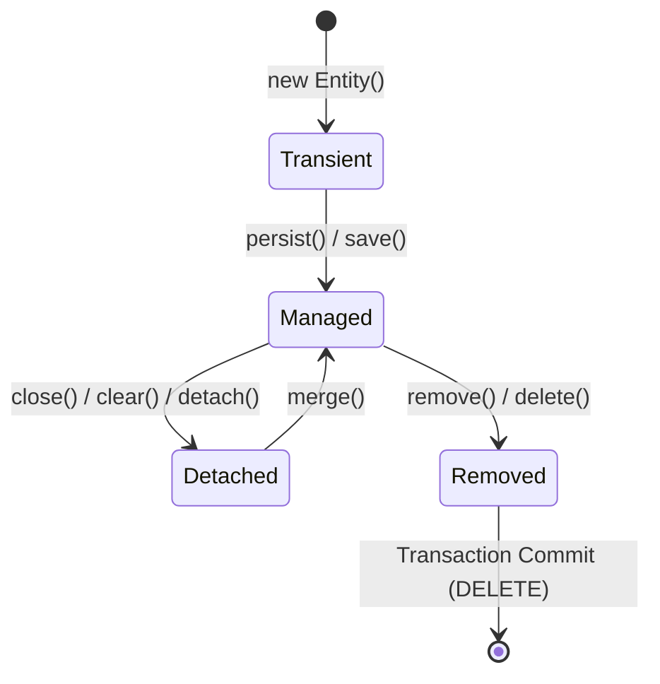

# Day 7: The Persistence Context & First-Level Cache (Deep Dive)

## A. Core Concept & Identity Map Pattern
The **Persistence Context** is an implementation of the **Identity Map Pattern**. It acts as an in-memory registry of all managed entities loaded within a logical transaction session.
* **First-Level (L1) Cache Scope:** It is bound **strictly** to the active Hibernate `Session` (which correlates to the current thread in Spring `@Transactional` scopes). It is **not** shared across threads.
* **Identity Guarantee:** For any record in the database, Hibernate guarantees that exactly one Java object instance will exist in memory.
  ```java
  User u1 = entityManager.find(User.class, 1L);
  User u2 = entityManager.find(User.class, 1L);
  System.out.println(u1 == u2); // Prints TRUE (same reference)
  ```

## B. Entity Lifecycle States
An entity occupies one of four states in relation to the Persistence Context:
1. **Transient:** Newly instantiated Java object (`new User()`). Not associated with a Session; has no database identifier (primary key).
2. **Managed:** Currently monitored by the Session. Any state mutations will be tracked and synchronized to the database. Holds an identifier.
3. **Detached:** Previously managed, but the Session has closed, cleared, or serialized. Mutations are **not** tracked.
4. **Removed:** Scheduled for deletion. Database `DELETE` will be executed during flush.



## C. Mechanics of L1 Cache Retrieval
When `findById` or `find` is invoked:
1. Hibernate checks the active `Session`'s internal Map (`StatefulPersistenceContext`).
2. If the entity is present (indexed by Entity Class and ID), it is returned instantly **without generating any SQL query**.
3. If not present, Hibernate runs the SQL SELECT query, creates the entity instance, stores it in the registry, and returns it.

## D. Senior-Level Interview Q&A
### Q1: If a method is annotated with `@Transactional(readOnly = true)`, is the L1 Cache active?
* **Answer:** **Yes.** The L1 cache is always active to guarantee entity identity and transaction isolation within the unit of work. However, Hibernate optimizes the session by disabling dirty check snapshot generation and locking flush mode to `MANUAL`, which reduces memory consumption and execution time.

### Q2: What happens if you call `entityManager.clear()` mid-transaction?
* **Answer:** It detaches all currently managed entities, clearing the L1 Cache. Any modifications to those entities that occurred before the clear but were not flushed are discarded. Subsequent database queries will hit the database again, retrieving fresh snapshots.
